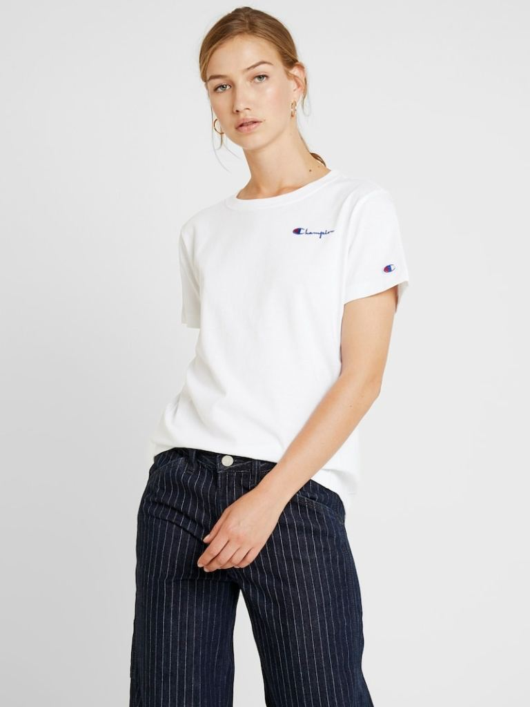
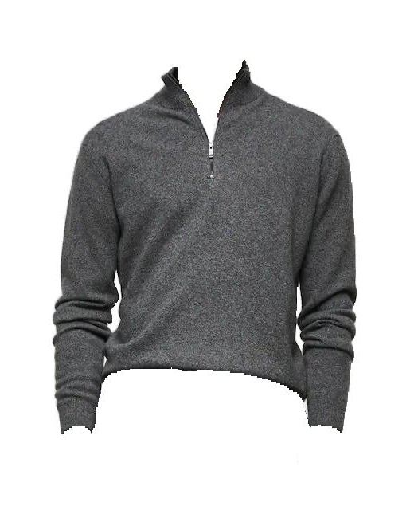
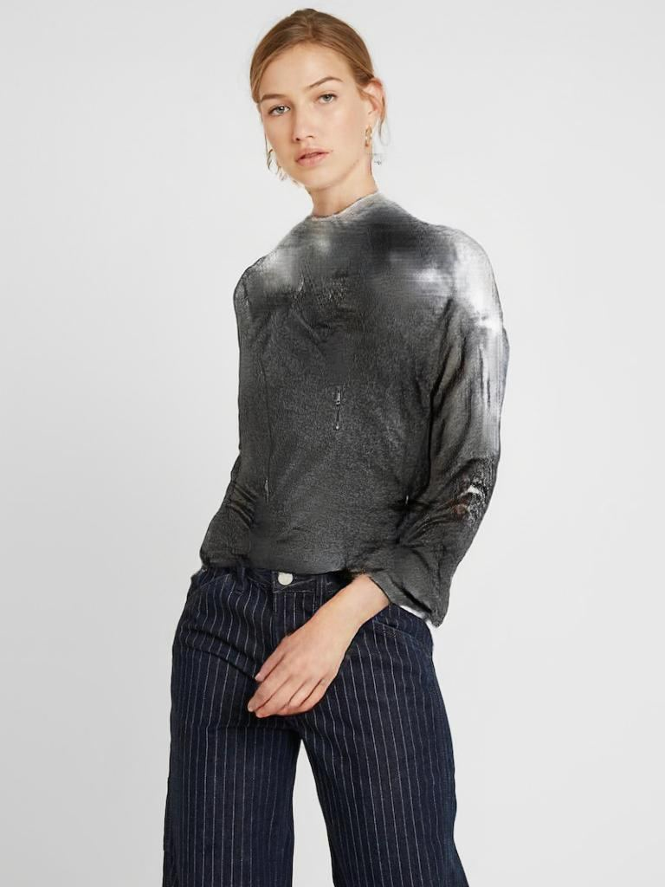
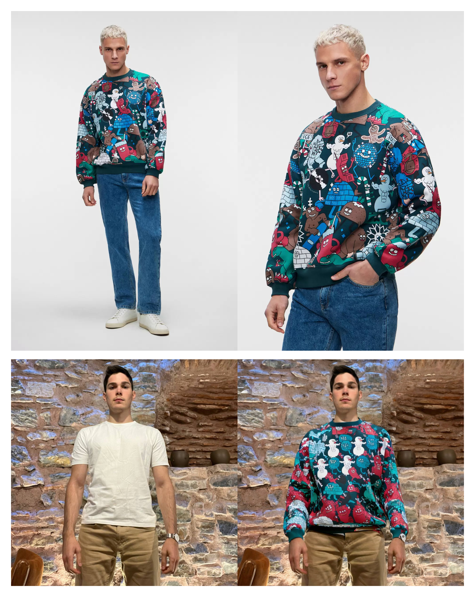
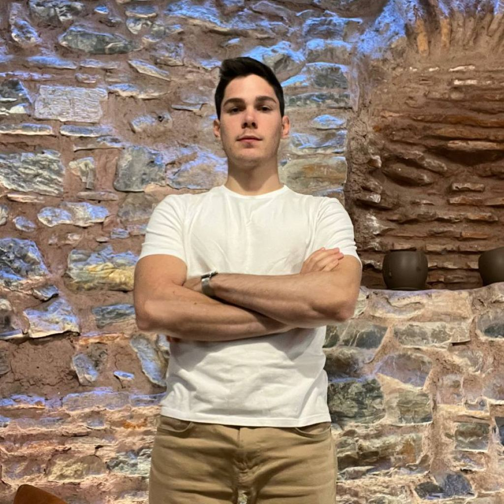
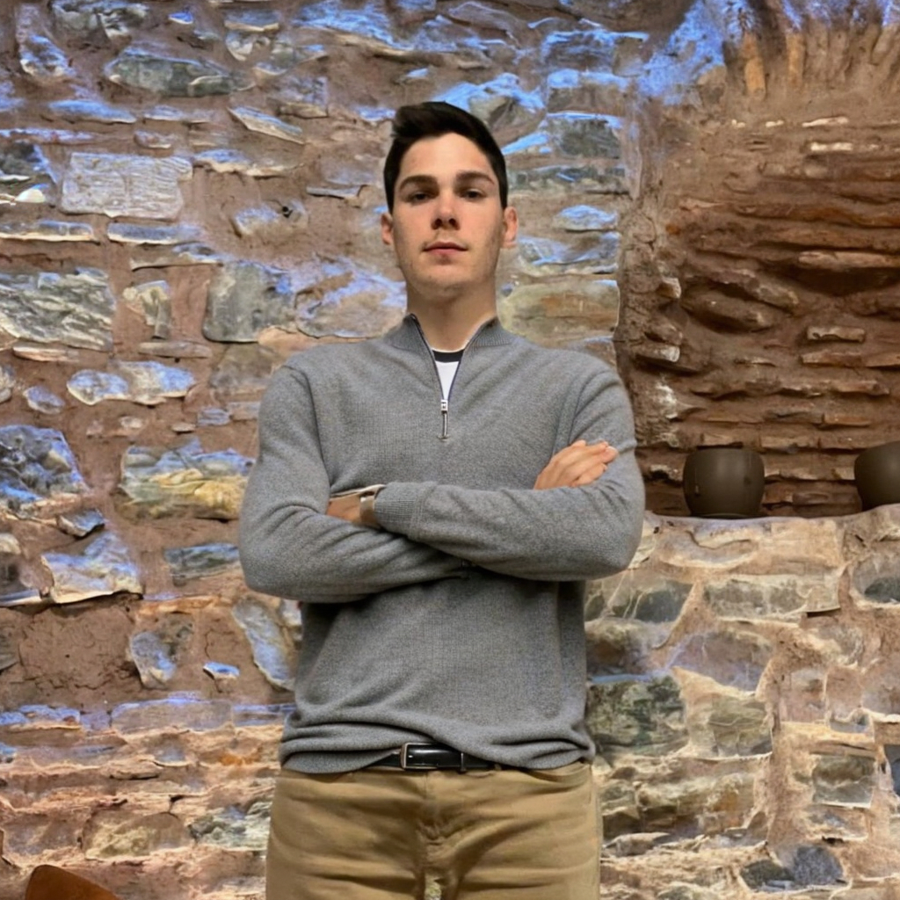

# Cloth virtual try-on using Stable Diffusion

I experimented with training Stable Diffusion image generation model for cloth virtual try on task.

## Problem

State of the art solutions [[1](https://paperswithcode.com/task/virtual-try-on)] use GAN architecture and mostly doesn’t seem to work great on an out of the dataset photos.

Here's an example of using a GAN model from [HR-VITON paper](https://paperswithcode.com/paper/high-resolution-virtual-try-on-with) with pre-trained weights from the paper's GitHub repository.

|    |            |   |
|:----------:|:-------------:|:------:|
| Person image from a training dataset |  Custom cloth image | GAN try-on result |

## Diffusion model results

I trained Stable Diffusion Inpainting model on two clothes:

- [Mango gray Zip-neck cashmere sweater](https://shop.mango.com/gb/men/cardigans-and-sweaters-sweaters/zip-neck-cashmere-sweater_47000550.html?c=95)
- [BeFree cotton sweatshirt with Christmas print](https://befree.ru/zhenskaya/product/2249207952$D/121)

| .jpg)   |            |
|:----------:|:-------------:|
| Diffusion try-on result 1 |  Diffusion try-on result 2 |

The model accurately reproduced the details of a gray sweater and adjusted the lighting of the photo. However, it did not accurately generate the print of the sweatshirt, though it was close. I couldn't resolve this issue with the current version of Stable Diffusion (2.1).

### Training details

I used a [dreambooth inpainting](https://github.com/huggingface/diffusers/tree/main/examples/research_projects/dreambooth_inpaint) training script and modified it to apply custom cloth masks and prompts. 

I used 1000 training steps, learning rate 5e-6, no regularization images, trained text encoder. 

| .jpg)   |      .jpg)      |  .png) |
|:----------:|:-------------:|:------:|
| Person image |  Hand-drawn person mask | Diffusion try-on results, A-pose |

As you can imagine, it's pretty inconvenient to hand-draw a mask. So, I came up with a way to generate it automatically; maybe I'll share it later.

|    |      .jpg)      |   |
|----------|:-------------:|------:|
| Person Image |  Auto-generated person mask | Diffusion try-on results, complex pose |

The model was able to generate clothes correctly even in a complex pose. 

## How to run training yourself

Check [dreambooth](https://github.com/huggingface/diffusers/tree/main/examples/research_projects/dreambooth_inpaint) repo for a reference. 

Install dependencies with `pip install -r requirements.txt`

Create cloth images directory and masks directory with images.  

Note that my training script will generate prompts from the image names. 
For example: “t-shirt (1).jpg” → “t-shirt”

Run training:

```bash
accelerate launch train_dreambooth_inpaint_my_prompts.py \
  --pretrained_model_name_or_path="stabilityai/stable-diffusion-2-inpainting"  \
  --instance_data_dir=$IMAGES_DIR \
  --instance_masks_data_dir=$MASKS_DIR \
  --output_dir=$OUTPUT_WEIGHTS_DIR \
  --train_text_encoder \
  --resolution=512 \
  --train_batch_size=1 \
  --gradient_accumulation_steps=1 --gradient_checkpointing \
  --use_8bit_adam \
  --learning_rate=2e-6 \
  --lr_scheduler="constant" \
  --lr_warmup_steps=0 \
  --max_train_steps=1000 \
  --checkpointing_steps=500
```

## Conclusion

Clothes with simple forms and textures work best today, while logos and prints are very hard to reproduce correctly with stable diffusion 2.1.

Despite these limitations, generative models will definitely unlock photorealistic try-on! 

[DM me](https://twitter.com/LiderAlexandr), if you’re interested in collaborating on this challenge.
